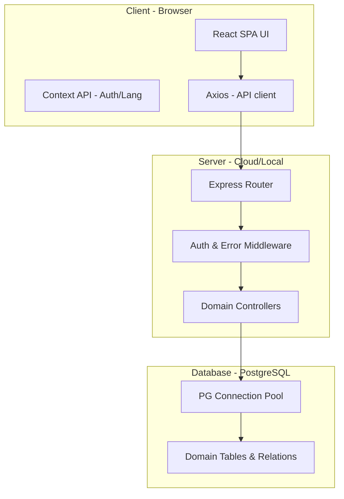

# Software Architecture Document - ASPO Larkana System

## 1. Architectural Patterns
The system follows a classic **Client-Server Architecture** with a clear separation of concerns between the frontend and backend.

### 1.1 Frontend (React SPA)
- **Framework**: React 18+ with `react-router-dom` v7.
- **State Management**: Context API (`AuthContext`, `LanguageContext`, `NotificationContext`).
- **Styling**: Tailwind CSS for utility-first design.
- **API Communication**: Axios instance with centralized configuration (`utils/api.js`).
- **Project Structure**:
    - `components/common`: Reusable UI components (DataTable, FormField, etc.).
    - `components/layout`: Global layout components (Sidebar, TopBar).
    - `pages/`: Domain-specific page components.
    - `locales/`: JSON translation files for EN/UR.

### 1.2 Backend (Node.js/Express REST API)
- **Framework**: Express.js.
- **Architecture**: MVC-inspired layout with Controllers and Routes.
- **Database Access**: PostgreSQL using the `pg` pool module.
- **Middleware**:
    - `auth.js`: JWT-based authentication and Role-Based Access Control (RBAC).
    - `errorHandler.js`: Global centralized error handling for all API requests.
- **Services**:
    - `auditLog.js`: Centralized service for recording all database changes.

## 2. System Components

## 3. Data Flow
1. **User Request**: User interacts with the React UI.
2. **API Call**: React triggers an Axios request (automatically including session cookies/headers).
3. **Middleware**: Express validates the JWT and checks the user's role.
4. **Controller Logic**: The specific controller function (e.g., `listStaff`) executes.
5. **Database Interaction**: The controller uses the `pg` pool to query the PostgreSQL database.
6. **Audit Recording**: If the action is a modification (POST/PUT/DELETE), the `auditLog` service records the change.
7. **API Response**: The controller sends a JSON response (success=true/false + data/error).
8. **UI Update**: React updates the state and re-renders the component.

## 4. Internationalization (i18n) Architecture
The system uses the `LanguageContext` to manage the global language state (`en` or `ur`).
- **Translation Utility**: A custom `t(key)` function retrieves strings from `en.json` or `ur.json`.
- **RTL Support**: The frontend dynamically sets `document.documentElement.dir = 'rtl'` when the Urdu language is active, ensuring the layout correctly mirrors itself.

## 5. Deployment and Scalability
- **Horizontal Scaling**: The Stateless API design (using JWT and a separate DB) allows the backend to be scaled horizontally if needed.
- **Production Build**: The React app is compiled into a static bundle using `react-scripts build` (or similar) and served via Nginx or a similar web server.
